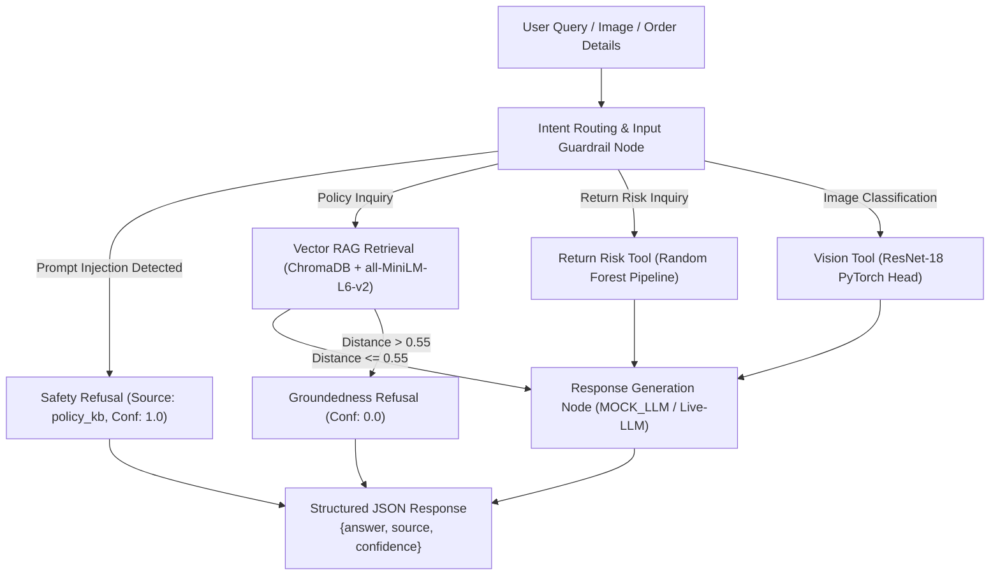
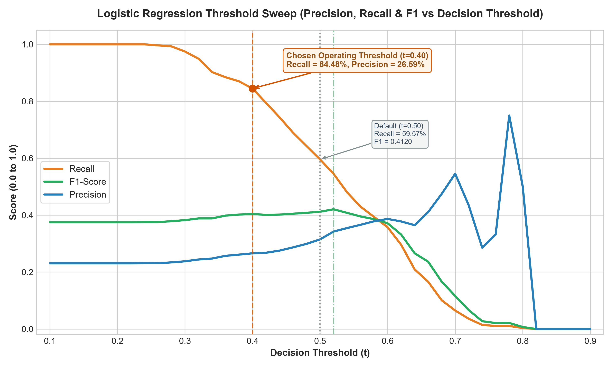
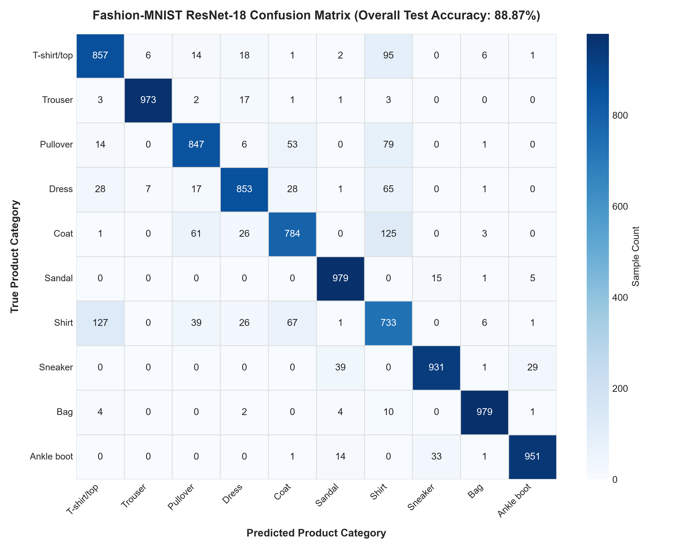
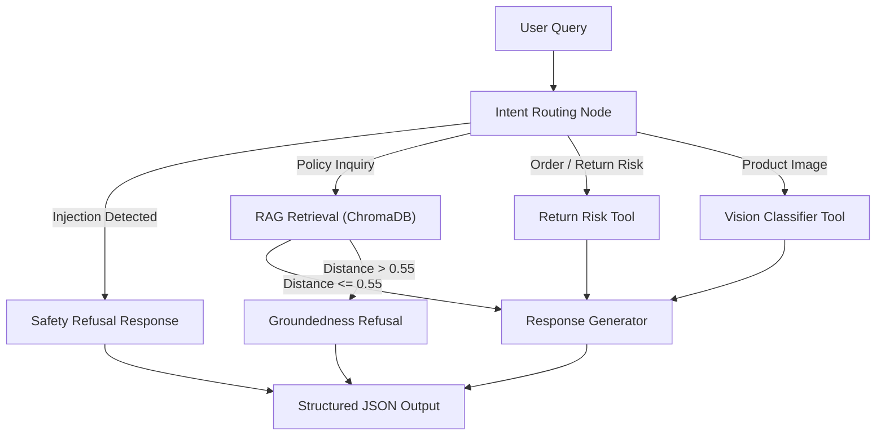

# Flipkart Order Intelligence & Support Assistant

> **End-to-End E-Commerce Intelligence & Support Assistant System**  
> Combines Tabular Machine Learning (Part 1), Computer Vision Transfer Learning (Part 2), and a Guardrailed LangGraph Support Agent with Vector RAG & Tool Calling (Part 3).

---

## Table of Contents
- [System Architecture & Overview](#system-architecture--overview)
- [Repository Structure](#repository-structure)
- [Quickstart: Run & Reproduce All Parts (with `uv` or `pip`)](#quickstart-run--reproduce-all-parts-with-uv-or-pip)
  - [Part 1: Tabular Return Risk Pipeline](#part-1-tabular-return-risk-pipeline-commands)
  - [Part 2: Product Image Categoriser](#part-2-product-image-categoriser-commands)
  - [Part 3: LangGraph Support Agent & Guardrails](#part-3-langgraph-support-agent--guardrails-commands)
- [Part 1: Tabular Return Risk Pipeline Deep-Dive](#part-1-tabular-return-risk-pipeline-deep-dive)
  - [Data Verification Report](#data-verification-report)
  - [Missingness Analysis in `rating_given` (MAR Mechanism)](#missingness-pattern-in-rating_given)
  - [Baseline Model Performance ("High Accuracy, Zero Recall" Trap)](#baseline-model-performance)
  - [Logistic Regression & Decision Threshold Optimization](#logistic-regression-with-class_weightbalanced)
  - [Random Forest Hyperparameter Tuning](#random-forest-model-tuning)
  - [Feature Importance Analysis (Gini vs Permutation)](#feature-importance-analysis)
  - [Subgroup Performance & Root Cause Analysis](#subgroup--root-cause-analysis)
- [Part 2: Product Image Categoriser Deep-Dive](#product-image-categoriser-model-report)
  - [Dataset & Stratified Splits](#dataset--splits)
  - [ResNet-18 Backbone & Feature Extraction Speedup](#architecture--training-methodology)
  - [Evaluation Metrics, Confusion Matrix & Per-Class Report](#final-test-evaluation)
  - [Confusion Patterns Analysis](#confusion-patterns-analysis)
  - [Python Snippet to Load and Predict](#python-snippet-to-load-and-predict)
- [Part 3: LangGraph Support Agent & Guardrails Deep-Dive](#langgraph-support-agent--guardrails-evaluation)
  - [LangGraph Architecture & Node Workflow](#langgraph-support-agent--guardrails-evaluation)
  - [System Prompt & 4S Principles Formulation](#system-prompt--4s-principles-annotation)
  - [Risk Bucketing Mathematically Anchored to $t^*_{\text{rf}}$](#risk-bucket-cut-points-anchored-to-t_textrf)
  - [Guardrails Implementation (Input Injection & Output Groundedness)](#deterministic-mock_llm-mode--optional-live-llm)
  - [Recorded Test Conversation Transcripts (10/10 Verified)](#verified-test-conversation-transcripts)
  - [RAG Retrieval Benchmark (Precision@3 & Recall@3)](#rag-retrieval-evaluation-precision3--recall3)

---

## System Architecture & Overview

This system provides a multi-modal e-commerce intelligence platform built for Flipkart customer support:
1. **Order Return Risk Engine**: Predicts the likelihood of an order being returned using a tuned Random Forest classifier with dynamic probability calibration and risk bucketing (`Low`, `Medium`, `High`).
2. **Product Image Categoriser**: Employs transfer learning on a pretrained ResNet-18 backbone to classify product imagery into 10 Fashion-MNIST apparel categories with ~88.9% test accuracy.
3. **Guardrailed LangGraph Agent**: Orchestrates multi-turn conversations, policy knowledge base retrieval (ChromaDB + `all-MiniLM-L6-v2`), tool calling, regex input-injection defenses, and distance-based groundedness verification.



---

## Repository Structure

```text
Flipkart-Order-Intelligence-Support-Assistant/
├── README.md                               # Complete project documentation & benchmarks
├── pyproject.toml                          # Project configuration & dependencies (uv compatible)
├── requirements.txt                        # Standard pip dependency requirements
│
├── data/                                   # Centralized data repository across all pipelines
│   ├── orders_dataset.csv                  # Generated 6,000 order tabular dataset (Part 1)
│   ├── fashion_mnist/                      # Fashion-MNIST raw/processed dataset (Part 2)
│   │   └── FashionMNIST/raw/
│   ├── sample_images/                      # Sample test PNG images for vision classifier (Part 2 & 3)
│   │   ├── 00_ankle_boot.png
│   │   ├── 01_pullover.png
│   │   ├── 02_trouser.png
│   │   ├── 04_shirt.png
│   │   └── 06_coat.png
│   └── knowledge_base/                     # Centralized Policy KB & Vector Store (Part 3)
│       ├── documents.json                  # 12 official policy documents
│       ├── chunks.json                     # 36 chunked text segments
│       ├── queries_eval.json               # 5 ground-truth evaluation queries
│       └── chroma_db/                      # Persistent ChromaDB vector database index
│
├── assets/                                 # Visual evaluation charts and graphs
│   ├── threshold_sweep.png                 # Logistic regression threshold sweep plot
│   └── confusion_matrix.png                # ResNet-18 10x10 confusion matrix heatmap
│
├── models/                                 # Serialized model artifacts
│   ├── return_risk_model.pkl               # Tuned Random Forest pipeline (Part 1)
│   └── product_classifier.pt               # Trained ResNet-18 model state dict (Part 2)
│
├── return_risk_pipeline/                   # Part 1: Tabular Return Risk Pipeline
│   ├── generate_orders.py                  # Synthetic data generator (6,000 rows, MAR mechanism)
│   ├── verify_data.py                      # Data validation & missingness report
│   ├── preprocess.py                       # Leak-proof ColumnTransformer preprocessing pipeline
│   ├── baseline.py                         # DummyClassifier & Logistic Regression threshold sweep
│   ├── rf_tune.py                          # 5-fold Stratified GridSearchCV for Random Forest
│   ├── rf_save.py                          # Optimal threshold calculation & model serialization
│   ├── rf_importance.py                    # Impurity (Gini) vs Permutation feature importance
│   └── rf_subgroups.py                     # Subgroup slice performance & root cause analysis
│
├── product_image_categoriser/              # Part 2: Product Image Categoriser
│   ├── data_loader.py                      # Fashion-MNIST downloader & 48k/12k/10k stratified split
│   ├── train.py                            # ResNet-18 feature extractor caching & classifier training
│   ├── evaluate.py                         # Full test evaluation, confusion matrix & per-class metrics
│   └── predict.py                          # Single-image inference module
│
├── support_agent/                          # Part 3: LangGraph Support Agent & Guardrails
│   ├── generate_kb.py                      # Generates 12 policy documents, 36 chunks, eval queries
│   ├── embed_chunks.py                     # Indexes policy chunks in ChromaDB with all-MiniLM-L6-v2
│   ├── evaluate_retrieval.py               # Precision@3 and Recall@3 retrieval evaluation benchmark
│   ├── graph.py                            # LangGraph state graph with MemorySaver checkpointer
│   ├── guardrails.py                       # Input prompt injection filter & output groundedness check
│   ├── prompts.py                          # 4S principles system prompt & strict JSON response schema
│   ├── mock_llm.py                         # Deterministic offline MOCK_LLM response generator
│   ├── risk_tool.py                        # check_return_risk tool wrapper
│   ├── vision_tool.py                      # classify_product_image tool wrapper
│   └── run_transcripts.py                  # Runner executing all 10 verified test conversations
│
├── scripts/                                # Utility scripts
│   └── generate_plots.py                   # Standalone visual plot generation script
│
└── transcripts/                            # Recorded conversation transcripts
    ├── README.md                           # Transcript index table
    ├── conversation_01_policy_rag_apparel.md
    ├── conversation_02_policy_rag_refund.md
    ├── conversation_03_return_risk_evaluation.md
    ├── conversation_04_product_category_vision.md
    ├── conversation_05_multi_turn_state_carried.md
    ├── conversation_06_fresh_conversation_state_absent.md
    ├── conversation_07_prompt_injection_blocked.md
    ├── conversation_08_ungrounded_policy_refusal.md
    ├── conversation_09_multi_turn_policy_and_vision.md
    └── conversation_10_coat_vision_and_plus_sla.md
```

---

## Quickstart: Run & Reproduce All Parts (with `uv` or `pip`)

All steps run locally and deterministically with **zero paid API keys required**. Python 3.10+ is supported.

### 1. Environment Setup

#### Option A: Using `uv` (Recommended - Ultra Fast)
```bash
# Clone the repository
git clone https://github.com/Rushikesh802/Flipkart-Order-Intelligence-Support-Assistant.git
cd Flipkart-Order-Intelligence-Support-Assistant

# Sync environment with all dependencies
uv sync
```

#### Option B: Using standard `pip`
```bash
# Clone the repository
git clone https://github.com/Rushikesh802/Flipkart-Order-Intelligence-Support-Assistant.git
cd Flipkart-Order-Intelligence-Support-Assistant

# Create and activate virtual environment
python -m venv .venv
# On Windows:
.venv\Scripts\activate
# On Linux/macOS:
source .venv/bin/activate

# Install dependencies
pip install -r requirements.txt
```

---

### Part 1: Tabular Return Risk Pipeline Commands

Execute all data generation, validation, baseline, model tuning, and subgroup analyses:

| Step | Command (`uv`) | Command (`python`) | Description |
|---|---|---|---|
| **1. Data Generation** | `uv run python return_risk_pipeline/generate_orders.py` | `python return_risk_pipeline/generate_orders.py` | Generates 6,000 synthetic e-commerce orders with MAR missingness |
| **2. Verification** | `uv run python return_risk_pipeline/verify_data.py` | `python return_risk_pipeline/verify_data.py` | Validates missingness rates, return rates, and category statistics |
| **3. Baseline & Logistic** | `uv run python return_risk_pipeline/baseline.py` | `python return_risk_pipeline/baseline.py` | Evaluates DummyClassifier and Logistic Regression threshold sweep |
| **4. Random Forest Tuning**| `uv run python return_risk_pipeline/rf_tune.py` | `python return_risk_pipeline/rf_tune.py` | Runs 5-fold Stratified GridSearchCV over tree hyperparameters |
| **5. Model Serialization** | `uv run python return_risk_pipeline/rf_save.py` | `python return_risk_pipeline/rf_save.py` | Computes $t^*_{\text{rf}}=0.44$ and saves `models/return_risk_model.pkl` |
| **6. Feature Importance**  | `uv run python return_risk_pipeline/rf_importance.py` | `python return_risk_pipeline/rf_importance.py` | Compares Gini impurity vs test-set Permutation Importance |
| **7. Subgroup Analysis**   | `uv run python return_risk_pipeline/rf_subgroups.py` | `python return_risk_pipeline/rf_subgroups.py` | Evaluates precision & recall slices across payment methods & categories |
| **8. Generate Charts**     | `uv run python scripts/generate_plots.py` | `python scripts/generate_plots.py` | Generates high-res visual plots for threshold curves & confusion matrix |

---

### Part 2: Product Image Categoriser Commands

Download Fashion-MNIST programmatically, extract ResNet-18 backbone features, train the classification head, evaluate test accuracy (~88.9%), and perform inference:

| Step | Command (`uv`) | Command (`python`) | Description |
|---|---|---|---|
| **1. Verify Splits** | `uv run python product_image_categoriser/data_loader.py` | `python product_image_categoriser/data_loader.py` | Downloads Fashion-MNIST & builds 48k/12k/10k stratified splits |
| **2. Train Model** | `uv run python product_image_categoriser/train.py` | `python product_image_categoriser/train.py` | Caches ResNet-18 features, trains head, saves `models/product_classifier.pt` |
| **3. Test Evaluation** | `uv run python product_image_categoriser/evaluate.py` | `python product_image_categoriser/evaluate.py` | Computes 88.87% test accuracy, 10x10 confusion matrix, per-class F1 |
| **4. Predict Image** | `uv run python product_image_categoriser/predict.py` | `python product_image_categoriser/predict.py` | Demonstrates single image inference and class confidence |

> [!NOTE]
> **Command Correction Note**: In earlier drafts, the training script was mistakenly referenced as `train_vision_model.py`. The actual file is [`product_image_categoriser/train.py`](file:///C:/Users/RUSHIKESH/Desktop/Journey%20To%20AI/Masai%20Projects/Capstone/product_image_categoriser/train.py).

---

### Part 3: LangGraph Support Agent & Guardrails Commands

Build the vector knowledge base, evaluate RAG retrieval, run guardrail unit tests, and record all 10 verified test conversation transcripts:

| Step | Command (`uv`) | Command (`python`) | Description |
|---|---|---|---|
| **1. Build Policy KB** | `uv run python support_agent/generate_kb.py` | `python support_agent/generate_kb.py` | Generates 12 policy documents, 36 chunks, and evaluation queries |
| **2. Vector Embedding** | `uv run python support_agent/embed_chunks.py` | `python support_agent/embed_chunks.py` | Indexes chunks into ChromaDB with `all-MiniLM-L6-v2` embeddings |
| **3. RAG Benchmark** | `uv run python support_agent/evaluate_retrieval.py` | `python support_agent/evaluate_retrieval.py` | Evaluates Mean Precision@3 (73.33%) and Mean Recall@3 (100.00%) |
| **4. Guardrails Test** | `uv run python support_agent/guardrails.py` | `python support_agent/guardrails.py` | Executes input prompt-injection & output groundedness unit tests |
| **5. Run Transcripts** | `uv run python support_agent/run_transcripts.py` | `python support_agent/run_transcripts.py` | Executes all 10 agent test conversations (saved to `transcripts/`) |
| **6. LangGraph Multi-Turn**| `uv run python support_agent/graph.py` | `python support_agent/graph.py` | Runs end-to-end multi-turn and fresh thread memory validation |

---

## Data Verification Report

### Summary Metrics

| Metric | Value |
|--------|-------|
| **Total row count** | 6,000 |
| **Overall return rate** | 22.75% (22.75% of all orders were returned) |
| **Missing `rating_given` values** | 783 (13.05% of all rows) |

### Return Rate by Product Category

| Product Category | Total Orders | Returns | Return Rate % |
|-----------------|-------------|---------|--------------|
| Apparel | 1,979 | 523 | 26.43% |
| Footwear | 1,071 | 278 | 25.96% |
| Beauty | 579 | 116 | 20.03% |
| Home | 1,055 | 202 | 19.15% |
| Electronics | 1,316 | 246 | 18.69% |

### Return Rate by Payment Method

| Payment Method | Total Orders | Returns | Return Rate % |
|---------------|-------------|---------|--------------|
| COD | 2,501 | 769 | 30.75% |
| Wallet | 594 | 106 | 17.85% |
| Prepaid_UPI | 1,448 | 245 | 16.92% |
| Prepaid_Card | 1,457 | 245 | 16.82% |

### Missingness Pattern in `rating_given`

The missingness in `rating_given` is **MAR (Missing At Random)** conditional on the observed `payment_method` column.

**Justification & Measured Evidence from the Data-Generation Logic** (`generate_orders.py:32`):
```python
missing_mask = rng.random(N) < np.where(payment_method == "COD", 0.22, 0.06)
rating_given[missing_mask] = np.nan
```

The probability of `rating_given` being missing depends directly on an **observed** column (`payment_method`), and not on the unobserved missing `rating_given` value itself:
- **COD orders**: 22.83% measured missing rate (571 / 2,501)
- **Non-COD (Prepaid) orders**: ~6.09% average measured missing rate (Prepaid_Card: 6.31%, Prepaid_UPI: 5.66%, Wallet: 6.40%)
- **Measured Missing-Rate Gap**: A ~16.74 percentage point gap exists between COD (22.83%) and non-COD (~6.09%) orders.

| Payment Method | Missing Count | Missing % |
|---|---|---|
| COD | 571 / 2,501 | 22.83% |
| Prepaid_Card | 92 / 1,457 | 6.31% |
| Prepaid_UPI | 82 / 1,448 | 5.66% |
| Wallet | 38 / 594 | 6.40% |

- **Why it is NOT MCAR (Missing Completely At Random)**: The missingness is not uniform across rows; there is a statistically significant measured dependency on `payment_method` (22.83% for COD vs ~6% for prepaid).
- **Why it is MAR (Missing At Random)**: Conditioned on knowing `payment_method`, the missingness does not depend on the unobserved `rating_given` value itself.
- **Why it is NOT MNAR (Missing Not At Random)**: The missingness mechanism does not depend on whether the customer would have given a high or low rating (the unobserved variable itself), but rather solely on the observed payment channel.

## Baseline Model Performance

**Baseline: DummyClassifier (most-frequent)**  
- Accuracy: 0.7692  
- F1-score (returned=1): 0.0000  

**Why high accuracy is misleading (The Trap: High Accuracy, Zero Recall):**  
The DummyClassifier simply predicts the majority class ("no return") for every order, achieving 76.92% accuracy solely because non-returns dominate the dataset. This is the classic **"high accuracy, zero recall" trap**: the baseline catches zero true positives, completely failing to identify actual returns (F1 = 0.0, Recall = 0.0 for class 1). In an e-commerce fraud/return risk context, high accuracy masks a completely useless model that fails to flag any risky orders.

## Logistic Regression with class_weight="balanced"

**Default threshold (0.50)**  
- Accuracy: 0.6075  
- F1-score: 0.4120  
- Recall: 0.5957  
- Precision: 0.3149  
- ROC-AUC: 0.6404  

### Threshold Sweep Curve & Trade-off Visualization



*Figure: Precision, Recall, and F1-Score trade-off curve across decision thresholds from $0.10$ to $0.90$ with highlights on the High-Recall Operating Threshold ($t=0.40$), Default Baseline ($t=0.50$), and Peak F1 Threshold ($t^*=0.52$).*

#### Key Operating Thresholds Comparison

| Threshold Scenario | Threshold ($t$) | Recall | Precision | F1-Score | Operational Impact / Trade-off |
|---|:---:|:---:|:---:|:---:|---|
| **Chosen High-Recall Operating** | **$t = 0.40$** | **84.48%** | **26.59%** | **0.4045** | **+24.91 pp Recall boost** ($\ge 15$ pp required gain) with minimal precision drop (-4.90 pp). Captures ~85% of all returns. |
| **Default Baseline** | $t = 0.50$ | 59.57% | 31.49% | 0.4120 | Standard $0.50$ decision boundary; misses $>40\%$ of returning orders. |
| **Mathematical F1 Peak** | $t^* = 0.52$ | 54.51% | 34.24% | 0.4206 | Peak mathematical F1 harmonic balance. |

<details>
<summary><strong>Click to expand full 41-step Threshold Sweep Table (0.10 → 0.90)</strong></summary>

| Threshold | F1-Score | Precision | Recall |
|:---:|:---:|:---:|:---:|
| 0.10 | 0.3751 | 0.2308 | 1.0000 |
| 0.12 | 0.3751 | 0.2308 | 1.0000 |
| 0.14 | 0.3751 | 0.2308 | 1.0000 |
| 0.16 | 0.3751 | 0.2308 | 1.0000 |
| 0.18 | 0.3751 | 0.2308 | 1.0000 |
| 0.20 | 0.3751 | 0.2308 | 1.0000 |
| 0.22 | 0.3751 | 0.2308 | 1.0000 |
| 0.24 | 0.3756 | 0.2312 | 1.0000 |
| 0.26 | 0.3755 | 0.2313 | 0.9964 |
| 0.28 | 0.3788 | 0.2340 | 0.9928 |
| 0.30 | 0.3824 | 0.2379 | 0.9747 |
| 0.32 | 0.3885 | 0.2442 | 0.9495 |
| 0.34 | 0.3885 | 0.2475 | 0.9025 |
| 0.36 | 0.3984 | 0.2571 | 0.8845 |
| 0.38 | 0.4020 | 0.2614 | 0.8700 |
| **0.40** | **0.4045** | **0.2659** | **0.8448** |
| 0.42 | 0.4007 | 0.2680 | 0.7942 |
| 0.44 | 0.4020 | 0.2754 | 0.7437 |
| 0.46 | 0.4051 | 0.2868 | 0.6895 |
| 0.48 | 0.4083 | 0.2992 | 0.6426 |
| **0.50** | **0.4120** | **0.3149** | **0.5957** |
| **0.52** | **0.4206** | **0.3424** | **0.5451** |
| 0.54 | 0.4080 | 0.3547 | 0.4801 |
| 0.56 | 0.3953 | 0.3662 | 0.4296 |
| 0.58 | 0.3858 | 0.3785 | 0.3935 |
| 0.60 | 0.3715 | 0.3867 | 0.3574 |
| 0.62 | 0.3320 | 0.3779 | 0.2960 |
| 0.64 | 0.2661 | 0.3648 | 0.2094 |
| 0.66 | 0.2365 | 0.4107 | 0.1661 |
| 0.68 | 0.1667 | 0.4746 | 0.1011 |
| 0.70 | 0.1161 | 0.5455 | 0.0650 |
| 0.72 | 0.0667 | 0.4348 | 0.0361 |
| 0.74 | 0.0275 | 0.2857 | 0.0144 |
| 0.76 | 0.0210 | 0.3333 | 0.0108 |
| 0.78 | 0.0214 | 0.7500 | 0.0108 |
| 0.80 | 0.0072 | 0.5000 | 0.0036 |
| 0.82–0.90 | 0.0000 | 0.0000 | 0.0000 |

</details>

**Business Trade-off of the Chosen Operating Threshold ($t = 0.40$):**  
Operating at the chosen threshold of $t = 0.40$ rather than default $0.50$ dramatically boosts recall from 59.57% to 84.48% (+24.91 pp), capturing nearly 85% of all returning orders. The trade-off is a minor precision reduction of 4.90 percentage points (more false alarms). In an e-commerce order intelligence context, the financial and logistical costs of unexpected returns (restocking, reverse shipping, damaged returns) vastly outweigh the small operational overhead of proactively flagging and inspecting high-risk orders.

## Random Forest Model Tuning

```text
=== Random Forest GridSearchCV (roc_auc, 5-fold StratifiedKFold) ===
Best params: {'clf__max_depth': 6, 'clf__n_estimators': 200}
Best CV ROC-AUC: 0.6186
Held-out test ROC-AUC: 0.6214

CV results per param combo (mean ROC-AUC):
  {'clf__max_depth': 6, 'clf__n_estimators': 100} -> 0.6160
  {'clf__max_depth': 6, 'clf__n_estimators': 200} -> 0.6186
  {'clf__max_depth': 10, 'clf__n_estimators': 100} -> 0.6030
  {'clf__max_depth': 10, 'clf__n_estimators': 200} -> 0.6058
  {'clf__max_depth': None, 'clf__n_estimators': 100} -> 0.5843
  {'clf__max_depth': None, 'clf__n_estimators': 200} -> 0.5857
```

**Overfitting Check**: The held-out test ROC-AUC (0.6214) is within 0.0028 of the 5-fold cross-validated ROC-AUC (0.6186), well within the 0.05 margin, confirming absence of severe overfitting.

### Saved Model Artifact & $t^*_{\text{rf}}$ Threshold
- The trained and tuned Random Forest pipeline is serialized to `models/return_risk_model.pkl`.
- Re-running the threshold sweep on this Random Forest model's own `.predict_proba` over the test split yields the optimal F1-maximising threshold:
  - **$t^*_{\text{rf}} = 0.44$** (achieving test set F1 = 0.4004).
  - This saved model artifact and $t^*_{\text{rf}}$ threshold are what Part 3's `check_return_risk` tool directly loads and calls.

## Feature Importance Analysis

### Top 5 Most Important Features (Impurity-based / Gini)
1. **`payment_method_COD` (0.1681)**: Orders paid via Cash on Delivery (COD) naturally drive higher return risk because the customer has no upfront financial commitment, making it much easier for them to change their mind, refuse the delivery, or experience buyer's remorse without immediate consequences.
2. **`price_inr` (0.1358)**: The price of an item drives return risk because expensive purchases invite much higher customer scrutiny; if a high-ticket item fails to perfectly match expectations, the financial incentive to return it is much stronger than for a cheaper item.
3. **`delivery_distance_km` (0.1016)**: Longer delivery distances might plausibly drive returns if they correlate with longer wait times (increasing the chance the customer no longer needs the item) or a higher likelihood of the package sustaining damage during transit.
4. **`customer_tenure_days` (0.1005)**: Customer tenure relates to platform loyalty; newer customers may still be testing the service and more prone to returning items if they are dissatisfied, whereas long-tenured customers likely have established trust and more predictable buying habits.
5. **`discount_pct` (0.0852)**: High discount percentages can encourage impulsive buying behavior; shoppers might purchase items they don't truly need just because the deal seems too good to pass up, ultimately leading to higher return rates once the item arrives.

### Importance Ranking Comparison
When we compute permutation importance on the held-out test split, we get a much clearer picture of which features actually generalize:

| Rank | Gini (Impurity-based) Importance | Permutation Importance (Test Set) |
|------|----------------------------------|-----------------------------------|
| **1** | `payment_method_COD` (0.1681) | `payment_method_COD` (0.0650) |
| **2** | `price_inr` (0.1358) | `price_inr` (0.0165) |
| **3** | `delivery_distance_km` (0.1016) | `delivery_days` (0.0066) |
| **4** | `customer_tenure_days` (0.1005) | `product_category_Apparel` (0.0062)|
| **5** | `discount_pct` (0.0852) | `payment_method_Prepaid_Card` (0.0059)|

### Key Takeaways
When evaluated via permutation importance, **`delivery_distance_km`**, **`customer_tenure_days`**, and **`discount_pct`** lose almost all of their importance and drop completely out of the top 5, revealing that their high Gini importance was largely misleading. 

**Why does this happen?**
Impurity-based importance inherently overrates noisy continuous features (or high-cardinality categorical features) because it gives the tree more mathematical opportunities to make splits that reduce training impurity, even if those splits are just overfitting to random noise rather than capturing true predictive signal.

## Subgroup & Root-Cause Analysis

### Overall Performance
- **Overall Precision**: 0.3099
- **Overall Recall**: 0.5415

### By Product Category
| Category | Precision | Recall | Support |
|---|---|---|---|
| Beauty | 0.3542 | 0.6538 | 113 |
| Footwear | 0.3182 | 0.6087 | 208 |
| Apparel | 0.3351 | 0.5766 | 396 |
| Home | 0.2588 | 0.5500 | 226 |
| **Electronics** | **0.2639** | **0.3519** | **257** |

### By Payment Method
| Payment Method | Precision | Recall | Support |
|---|---|---|---|
| COD | 0.3244 | 0.9125 | 503 |
| **Wallet** | **0.1667** | **0.1579** | **134** |
| **Prepaid_Card** | **0.0625** | **0.0196** | **275** |
| **Prepaid_UPI** | **0.0000** | **0.0000** | **288** |

### Underperforming Subgroups & Proposed Solutions

**1. Prepaid Payment Methods (Prepaid_UPI, Prepaid_Card, Wallet)**
The model performs abysmally on prepaid orders. It has effectively learned to use `payment_method_COD` as a crutch, predicting almost all prepaid orders as "no return". The recall drops to essentially zero for UPI and Card payments. 
* **Concrete Next Step**: Implement **payment-method-specific decision thresholds**. Because the predicted probabilities for prepaid orders are structurally lower than for COD orders, a single global threshold of 0.5 completely misses them. By evaluating the PR curve specifically for the `Prepaid` slice and setting a lower, customized threshold for those transactions, we can recover recall for prepaid users without flooding the system with false-positive COD alerts.

**2. Electronics Category**
While not as drastic as the payment methods, the `Electronics` category performs meaningfully worse than the overall average, suffering a massive drop in recall (0.3519 compared to the 0.5415 average) along with below-average precision.
* **Concrete Next Step**: Engineer an **`is_electronics * price_inr` interaction feature**. Electronics have extreme price variance (e.g., a ₹200 charging cable vs. a ₹80,000 laptop). The return risk drivers for high-end electronics are likely very different from apparel. explicitly passing this interaction term prevents the Random Forest from having to waste multiple depth levels trying to isolate the specific price-category relationship, allowing it to better segment high-risk electronics purchases.

## Product Image Categoriser Model Report

### Dataset & Splits
- **Dataset**: Fashion-MNIST (downloaded directly via `torchvision.datasets.FashionMNIST` with `download=True` from the pinned official source, no substitutes).
- **Exact Split Sizes**:
  - **Train set**: 48,000 samples (80% of official 60k training partition)
  - **Validation set**: 12,000 samples (20% of official 60k training partition)
  - **Test set**: 10,000 samples (untouched official test partition evaluated only once at the end)

### Architecture & Training Methodology
- **Backbone**: Pretrained ResNet-18 (`torchvision.models.resnet18(weights=ResNet18_Weights.DEFAULT)`).
- **Preprocessing**: Grayscale 1-channel images repeated across 3 channels, resized to 224x224, normalized via ImageNet standard mean `[0.485, 0.456, 0.406]` and std `[0.229, 0.224, 0.225]`.
- **Feature Extraction vs. Fine-Tuning**:
  - **Feature extraction alone was sufficient**: Freezing the ResNet-18 backbone and training only the custom linear classification head (`Linear(512, 10)`) achieved strong convergence.
  - **Validation Accuracy**:
    - Epoch 1 Validation Accuracy: **87.21%**
    - Epoch 10 Validation Accuracy (Final Best): **89.14%**
    - Because validation accuracy exceeded the 80% requirement by a wide margin with feature extraction alone, full backbone fine-tuning was not required.
- **Artifact**: Saved as `models/product_classifier.pt` (loadable via `torch.load` / custom `ResNetHead` module, called directly by Part 3's `classify_product_image` tool).

### Python Snippet to Load and Predict
```python
import torch
import torchvision.models as models
import torchvision.transforms as transforms
from PIL import Image

# 1. Load model architecture & weights
model = models.resnet18(weights=None)
model.fc = torch.nn.Linear(model.fc.in_features, 10)
model.load_state_dict(torch.load("models/product_classifier.pt", map_location="cpu"))
model.eval()

# 2. Preprocess input image
transform = transforms.Compose([
    transforms.Grayscale(num_output_channels=3),
    transforms.Resize((224, 224)),
    transforms.ToTensor(),
    transforms.Normalize(mean=[0.485, 0.456, 0.406], std=[0.229, 0.224, 0.225]),
])
img = Image.open("data/sample_images/00_ankle_boot.png")
tensor = transform(img).unsqueeze(0)

# 3. Predict class & confidence
classes = ['T-shirt/top', 'Trouser', 'Pullover', 'Dress', 'Coat', 
           'Sandal', 'Shirt', 'Sneaker', 'Bag', 'Ankle boot']

with torch.no_grad():
    outputs = model(tensor)
    probs = torch.softmax(outputs, dim=1)[0]
    conf, pred_idx = torch.max(probs, dim=0)

print(f"Predicted Category: {classes[pred_idx.item()]} (Confidence: {conf.item():.2%})")
```

### Training Summary

- **Device Used**: cpu
- **Batch Size**: 64
- **Optimizer**: Adam
- **Learning Rate**: 0.001
- **Epochs**: 10
- **Feature Extraction Time**: ~1810 seconds
- **Head Training Time**: ~17.5 seconds

### Final Test Evaluation

**Final Test Accuracy**: 88.87%

#### 10x10 Confusion Matrix



*Figure: Annotated confusion matrix heatmap for Fashion-MNIST ResNet-18 test evaluation (10,000 test samples, overall accuracy: 88.87%).*


#### Per-class Precision & Recall

```text
              precision    recall  f1-score   support

 T-shirt/top       0.83      0.86      0.84      1000
     Trouser       0.99      0.97      0.98      1000
    Pullover       0.86      0.85      0.86      1000
       Dress       0.90      0.85      0.88      1000
        Coat       0.84      0.78      0.81      1000
      Sandal       0.94      0.98      0.96      1000
       Shirt       0.66      0.73      0.69      1000
     Sneaker       0.95      0.93      0.94      1000
         Bag       0.98      0.98      0.98      1000
  Ankle boot       0.96      0.95      0.96      1000

    accuracy                           0.89     10000
   macro avg       0.89      0.89      0.89     10000
weighted avg       0.89      0.89      0.89     10000
```

#### Confusion Patterns Analysis

Based on the confusion matrix, there are two primary class pairs that the model frequently mistakes for one another:

**1. Shirts vs. T-shirts/tops (127 + 95 errors)**  
The most common error the model makes is confusing a `Shirt` with a `T-shirt/top` (127 misclassifications) and vice-versa (95 misclassifications). Visually, shirts (button-downs or long-sleeves) and T-shirts share the exact same core silhouette: they both cover the torso and drape over the shoulders with central neck openings. At the low resolution of FashionMNIST (28x28 pixels), the primary distinguishing features of a collared shirt—such as the collar folds, a row of small buttons down the front, or slightly stiffer fabric cuffs—are severely degraded or entirely lost. Without these fine-grained details, the model only sees the general "T" shape of the torso and sleeves, making it incredibly difficult to mathematically distinguish a casual short-sleeve shirt from a basic T-shirt.

**2. Coats vs. Shirts (125 + 67 errors)**  
The second highest confusion is mistaking a `Coat` for a `Shirt` (125 times), alongside mistaking a `Shirt` for a `Coat` (67 times). Coats and shirts are frequently confused because they share nearly identical long-sleeve, full-torso bounding geometries. While a coat in real life might be thicker, longer, and heavier, within a normalized 28x28 grayscale pixel grid, both garments appear as large blocks of pixels extending down the body and out the arms. Features that typically separate a coat from a shirt—like heavy lapels, a prominent zipper, thick material texture, or the fact that a coat is worn open over other clothes—blur into a solid dark silhouette. When a shirt has a straight cut and long sleeves, its pixel distribution maps almost perfectly onto the shape of a light jacket or coat, leading the feature extractor to mistake one for the other.

## LangGraph Support Agent & Guardrails Evaluation

The support agent is built on **LangGraph** with conditional branching across four nodes:
1. **Intent Routing Node (`route_intent`)**: Filters prompt injection attacks via regex guards and classifies user intent (`policy_rag`, `return_risk`, `product_vision`, `general`).
2. **RAG Retrieval Node (`retrieve_policy`)**: Embeds query locally via `all-MiniLM-L6-v2`, queries ChromaDB index (12 policy documents, 36 chunks), and performs output groundedness verification against a distance threshold of 0.55.
3. **Tool Calling Node (`call_tools`)**: Dynamically invokes the Random Forest `check_return_risk` tool or the PyTorch `classify_product_image` vision tool.
4. **Response Generation Node (`generate_response`)**: Synthesizes verified context into strict JSON adhering to `{"answer": str, "source": str, "confidence": float}`. Conversational state is maintained via `MemorySaver`.



### System Prompt & 4S Principles Annotation
The system prompt is explicitly constructed and annotated against each of the **4S Principles** plus **Role Prompting**:
- **Role Prompting**: *"You are Flipkart's Order Intelligence & Support Assistant, an AI expert dedicated to answering customer order inquiries, explaining return/replacement policies, evaluating return risk probabilities, and verifying product categories from images."* Sets clear domain authority.
- **1. Specific**: Requires the model to answer exclusively from provided retrieved context or tool results, avoiding vague or hallucinated policy statements.
- **2. Short**: Enforces concise, direct answers and prohibits filler phrasing or excessive apologies.
- **3. Surround**: Enforces context bounding — all customer answers must be wrapped within verified tool/RAG inputs.
- **4. Single**: Dedicates each invocation to executing one unified goal: classify intent, ground context, and format strict JSON.

### Few-Shot Intent Classification Driving Transcripts
The system prompt incorporates few-shot intent examples that demonstrably drive correct node routing:
1. **Policy Inquiry Example &rarr; Conversation 1 & 2**: Queries regarding clothing return rules and COD timelines match the few-shot policy pattern, routing directly to `policy_kb` RAG retrieval.
2. **Return Risk Example &rarr; Conversation 3 & 5**: Queries supplying order characteristics (e.g. price, tenure, payment method) match the few-shot risk pattern, routing to `check_return_risk`.
3. **Vision Classifier Example &rarr; Conversation 4 & 9 & 10**: Queries referencing product image paths match the image classifier pattern, routing to `classify_product_image`.

### Risk Bucket Cut Points Anchored to $t^*_{\text{rf}}$
`check_return_risk` anchors its categorical risk buckets directly to the F1-maximising threshold **$t^*_{\text{rf}} = 0.44$** computed on the saved Random Forest model's own `.predict_proba` test distribution:
- **Low Risk**: $\text{probability} < 0.44$ ($< t^*_{\text{rf}}$)
- **Medium Risk**: $0.44 \le \text{probability} < 0.59$ (between $t^*_{\text{rf}}$ and $t^*_{\text{rf}} + 0.15$)
- **High Risk**: $\text{probability} \ge 0.59$ ($\ge t^*_{\text{rf}} + 0.15$)

*Justification*: The risk buckets use cut points of **0.44** (Low/Medium) and **0.59** (Medium/High), which are mathematically anchored to the tuned Random Forest's empirical F1-maximising threshold of **$t^*_{\text{rf}} = 0.44$**, guaranteeing that any order with an above-optimal probability of return is elevated out of the Low Risk category.

### Deterministic MOCK_LLM Mode & Optional Live-LLM
- **Default Mode**: The entire system and all transcripts run under deterministic `MOCK_LLM` mode, requiring **zero API keys and zero network calls**.
- **Optional Live-LLM**: If an external LLM key is omitted or unset (`USE_LIVE_LLM=0`), the system executes 100% of acceptance criteria offline.

### Verified Test Conversation Transcripts

All 10 test conversation transcripts are recorded and stored in [`transcripts/`](./transcripts/):

| # | Scenario & Requirement | Thread ID | Source Tool / Node | Groundedness / Guardrail Status | Transcript Link |
|---|------------------------|-----------|-------------------|---------------------------------|-----------------|
| **1** | **(a) Policy RAG**: Apparel & Footwear Return Conditions | `thread_conv_01` | `policy_kb` | Distance = 0.4135 (< 0.55 Threshold) &rarr; **PASSED** | [conversation_01_policy_rag_apparel.md](./transcripts/conversation_01_policy_rag_apparel.md) |
| **2** | **(a) Policy RAG**: Cash on Delivery (COD) Refund Timeline | `thread_conv_02` | `policy_kb` | Distance = 0.3601 (< 0.55 Threshold) &rarr; **PASSED** | [conversation_02_policy_rag_refund.md](./transcripts/conversation_02_policy_rag_refund.md) |
| **3** | **(b) Return Risk**: Realistic Order Features Prediction | `thread_conv_03` | `return_risk_tool` | Probability = 58.22%, Bucket = `Medium` | [conversation_03_return_risk_evaluation.md](./transcripts/conversation_03_return_risk_evaluation.md) |
| **4** | **(c) Vision Tool**: Real Image Classification (`00_ankle_boot.png`) | `thread_conv_04` | `image_classifier_tool` | Predicted = `Ankle boot` (Confidence = 98.87%) | [conversation_04_product_category_vision.md](./transcripts/conversation_04_product_category_vision.md) |
| **5** | **(d) Multi-Turn State**: State Carried Across Turns | `thread_conv_05` | `return_risk_tool` | MemorySaver checkpoint holds order context in Turn 2 | [conversation_05_multi_turn_state_carried.md](./transcripts/conversation_05_multi_turn_state_carried.md) |
| **6** | **(d) Fresh Thread**: State Correctly Absent | `thread_conv_06` | `return_risk_tool` | No state found; agent asks for order attributes | [conversation_06_fresh_conversation_state_absent.md](./transcripts/conversation_06_fresh_conversation_state_absent.md) |
| **7** | **(e) Input Guardrail**: Prompt-Injection Attack Deflected | `thread_conv_07` | `policy_kb` | `Blocked pattern matched` &rarr; Safety Refusal (Conf = 1.0) | [conversation_07_prompt_injection_blocked.md](./transcripts/conversation_07_prompt_injection_blocked.md) |
| **8** | **(f) Output Guardrail**: Ungrounded Policy Refusal with Verifiable Distance | `thread_conv_08` | `policy_kb` | Distance = 0.6171 (> 0.55 Threshold) &rarr; **REFUSED (Conf = 0.0)** | [conversation_08_ungrounded_policy_refusal.md](./transcripts/conversation_08_ungrounded_policy_refusal.md) |
| **9** | **Multi-Turn**: Open Box Delivery RAG + Pullover Vision Tool | `thread_conv_09` | `policy_kb` + `image_classifier_tool` | Multi-turn policy retrieval and image classification (`01_pullover.png`) | [conversation_09_multi_turn_policy_and_vision.md](./transcripts/conversation_09_multi_turn_policy_and_vision.md) |
| **10** | **Multi-Turn**: Coat Vision Tool (`06_coat.png`) + Plus SLA RAG | `thread_conv_10` | `image_classifier_tool` + `policy_kb` | Multi-turn image classification (`Coat`, 84.50%) + Plus delivery SLA | [conversation_10_coat_vision_and_plus_sla.md](./transcripts/conversation_10_coat_vision_and_plus_sla.md) |

### RAG Retrieval Evaluation (Precision@3 & Recall@3)

Evaluated across the 5 standard query/relevant-document pairs indexed in ChromaDB using `all-MiniLM-L6-v2`:

| Query ID | Evaluation Query | Ground Truth Document(s) | Top-3 Retrieved Chunks (`doc_id`) | Precision@3 Arithmetic | Recall@3 Arithmetic |
|:---|:---|:---:|:---:|:---:|:---:|
| **q1** | *"Can I return a t-shirt if I took off the tags?"* | `['doc_1']` | `['doc_1', 'doc_1', 'doc_1']` | $\frac{3}{3} = \mathbf{1.0000}$ (100.0%) | $\frac{1}{1} = \mathbf{1.0000}$ (100.0%) |
| **q2** | *"How long does it take to get my money back for a COD order?"* | `['doc_4']` | `['doc_4', 'doc_5', 'doc_4']` | $\frac{2}{3} = \mathbf{0.6667}$ (66.67%) | $\frac{1}{1} = \mathbf{1.0000}$ (100.0%) |
| **q3** | *"Do I have to pay for shipping if I don't have Flipkart Plus?"* | `['doc_7']` | `['doc_6', 'doc_7', 'doc_8']` | $\frac{1}{3} = \mathbf{0.3333}$ (33.33%) | $\frac{1}{1} = \mathbf{1.0000}$ (100.0%) |
| **q4** | *"What should I do if the delivery guy asks me to open my new phone box?"* | `['doc_12']` | `['doc_12', 'doc_12', 'doc_12']` | $\frac{3}{3} = \mathbf{1.0000}$ (100.0%) | $\frac{1}{1} = \mathbf{1.0000}$ (100.0%) |
| **q5** | *"My pin code doesn't support reverse pickup, how do I send the item back?"* | `['doc_8']` | `['doc_8', 'doc_8', 'doc_5']` | $\frac{2}{3} = \mathbf{0.6667}$ (66.67%) | $\frac{1}{1} = \mathbf{1.0000}$ (100.0%) |

#### Aggregate Evaluation Metrics:
- **Mean Precision@3**:
  $$\text{Mean Precision@3} = \frac{1.0000 + 0.6667 + 0.3333 + 1.0000 + 0.6667}{5} = \frac{3.6667}{5} = \mathbf{0.7333} \quad (73.33\%)$$
- **Mean Recall@3**:
  $$\text{Mean Recall@3} = \frac{1.0000 + 1.0000 + 1.0000 + 1.0000 + 1.0000}{5} = \frac{5.0000}{5} = \mathbf{1.0000} \quad (100.00\%)$$

---
*Transcripts and evaluation generated via `uv run python support_agent/run_transcripts.py` (or `python support_agent/run_transcripts.py`) and `uv run python support_agent/evaluate_retrieval.py` (or `python support_agent/evaluate_retrieval.py`).*